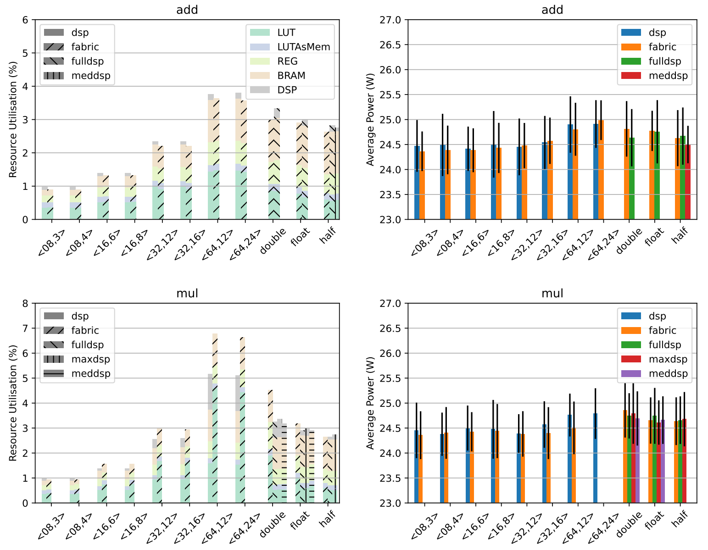
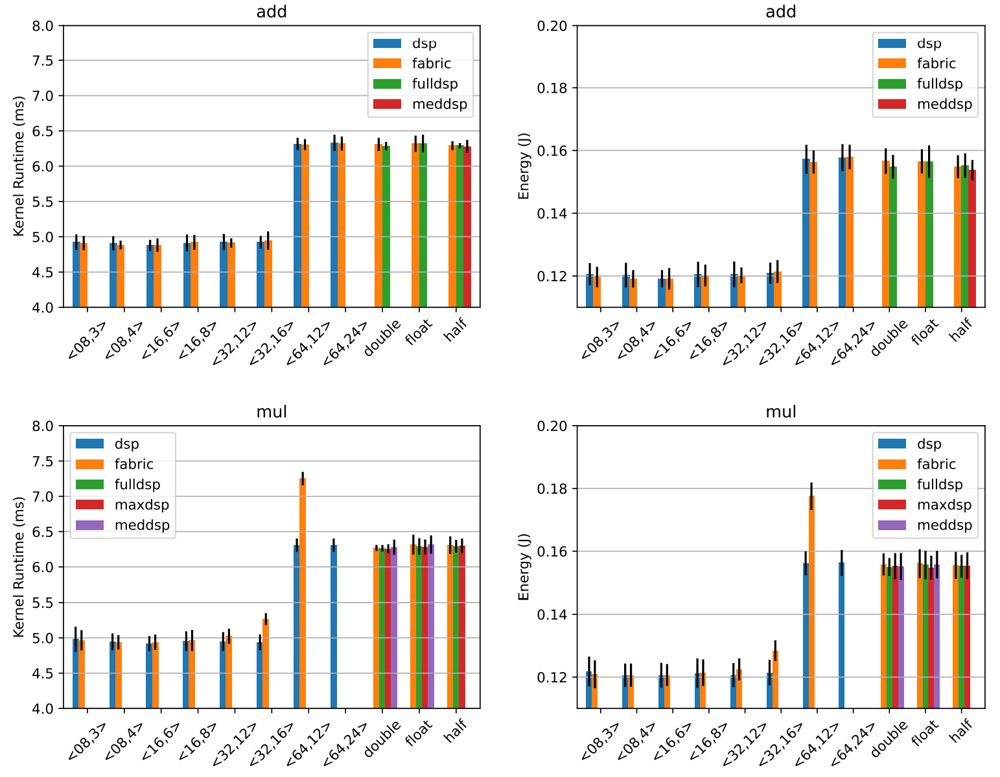

# Benchmarking Vitis implementation types of arithmetic operations in fixed-point and floating-point precision

The flexible nature of FPGAs provides the ability to tailor data types and arithmetic operators to custom requirements, where Xilinx's Vitis HLS supports arbitrary precision fixed-point types as well as double, single, and half precision floating-point data types. Furthermore, recent FPGA devices, including the Alveo and Versal series, provide hardened DSPs supporting floating-point arithmetic, such as the DSP48E2 and the DSP58 blocksets. Historically, relying on fixed-point arithmetic was common practice where floatingpoint support was costly to implement in space and performance. More recently, with SOTA FPGAs providing hardened DSPs for dedicated floating-point arithmetic, the dynamic range and precision of floating-point types are sometimes a prerequisite for high-accuracy implementations. Whilst the hardened DSPs for floating-point arithmetic are the new common across high-end FPGAs such as the Intel Stratix, Agilex or AMD Xilinx Alveo and Versal devices, reducing precision offers the possibility to reduce resource utilisation and potentially power draw. Consequently, with the development of new architectures and the adaptability of FPGAs, an important question is how developer choices around precision affect performance and energy usage.

Benchmarking the performance and energy-efficiency properties of arithmetic operations, `vitis_microbench` is a benchmark suite for evaluation on the Programmable Logic (PL) of AMD-Xilinx FPGAs, such as the Alveo U280 and Versal VCK5000 and is expected to work with other generations of Xilinx PL. The benchmark suite implements arithmetic operations as microkernels, enabling the individual evaluation of resource utilisation, power draw, runtime performance, and energy usage.




## Install

```
git clone git@github.com:markxio/vitis_microbench.git
cd vitis_microbench

git submodule init
git submodule update

python3 -m venv venv
source venv/bin/activate

pip install -e .
```

Instructions to build kernels, run the bitstream on hardware, report performance results and plot visualisations are provided in [vitis_microbench/README.md](vitis_microbench/README.md).
